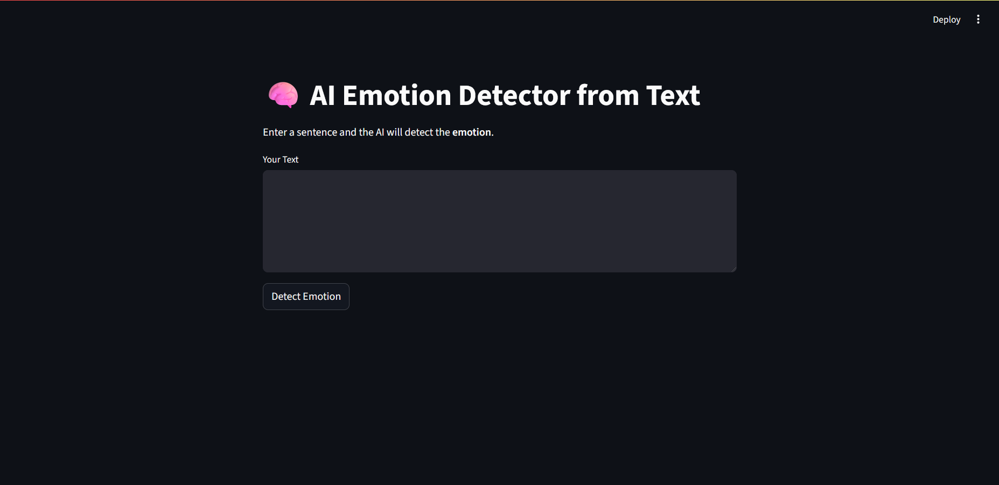
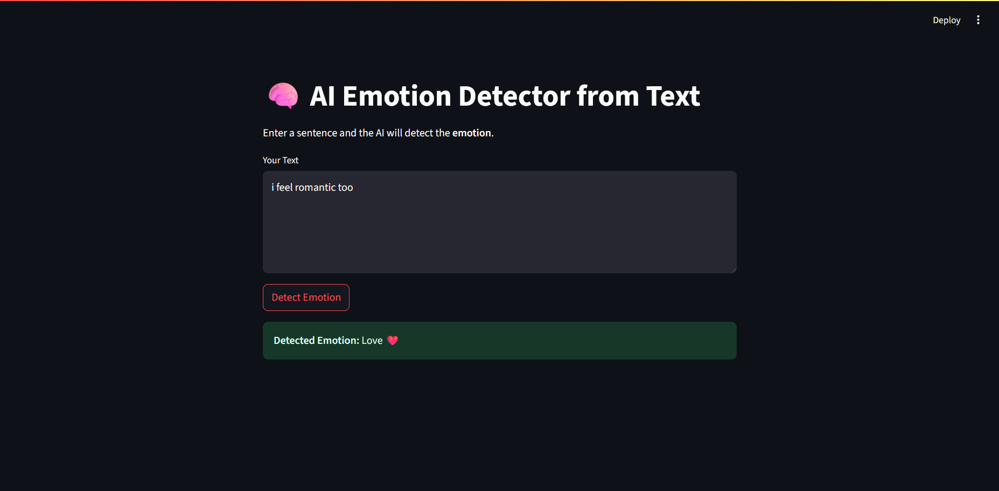
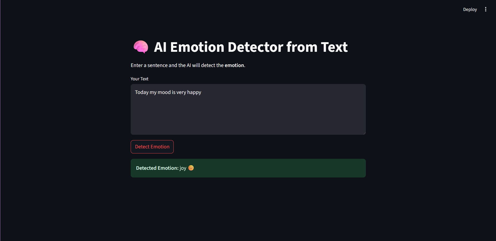
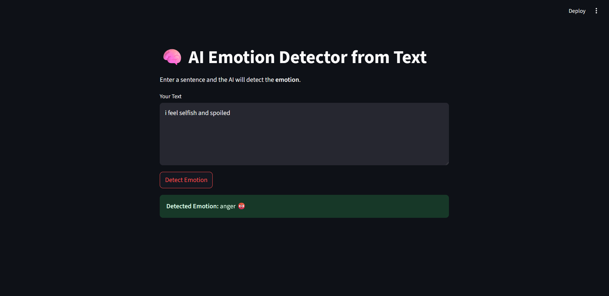
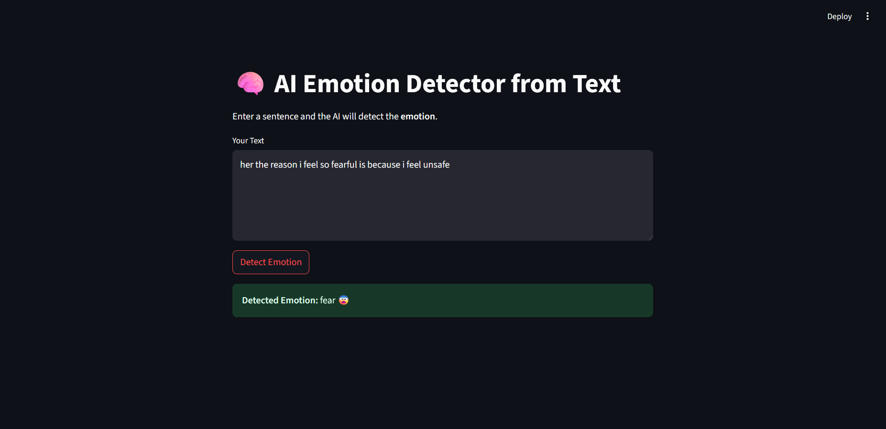

# 🧠 Emotion Detector from Text

This project is an **AI-powered Emotion Detection Web App** that identifies the emotional tone (like joy, sadness, anger, etc.) from user-provided text using Machine Learning and NLP.

---

## 💡 Features

- Detects emotion from text input (joy, sadness, anger, love, surprise, fear)
- Built using **Scikit-learn**, **Pandas**, and **Streamlit**
- Easy and clean web UI
- Trained on labeled emotion dataset

---

## 🚀 Technologies Used

- Python
- Scikit-learn
- Pandas
- Streamlit
- Natural Language Processing (NLP)

---

## 📁 Project Structure

```plaintext
emotion-detector/
│
├── app.py                    # Streamlit web app frontend
├── model_trainer.py          # ML model training script
├── requirements.txt          # All Python dependencies
├── preview.png               # Screenshot of the web app
├── README.md                 # Project documentation
│
├── model/                    # Folder containing saved ML model & vectorizer
│   ├── emotion_detector.pkl  # Trained model (saved using joblib)
│   └── vectorizer.pkl        # CountVectorizer for text preprocessing
│
├── data/                     
│   └── emotion_dataset.csv   # Labeled text dataset with emotions
│
└── .venv/                    # (optional) Python virtual environment folder
```   

---

## 📊 Dataset

- Dataset File: [`data/emotion_dataset.csv`](data/emotion_dataset.csv)
- Source: [Kaggle – Emotions Dataset for NLP](https://www.kaggle.com/datasets/praveengovi/emotions-dataset-for-nlp)

---
---

## 📸 App Screenshots








---
## 👩‍💻 Author

**Rishwa Patel** – [GitHub Profile](https://github.com/rishwapatel16)

---

## 📦 Installation

```bash
# Clone the repository
git clone https://github.com/rishwapatel16/emotion-detector.git

# Navigate to the project directory
cd emotion-detector

# Create a virtual environment (optional but recommended)
python -m venv .venv

# Activate the virtual environment
# For Windows:
.venv\Scripts\activate
# For macOS/Linux:
source .venv/bin/activate

# Install required packages
pip install -r requirements.txt

# Train the model
python model_trainer.py

# Run the web app
streamlit run app.py
